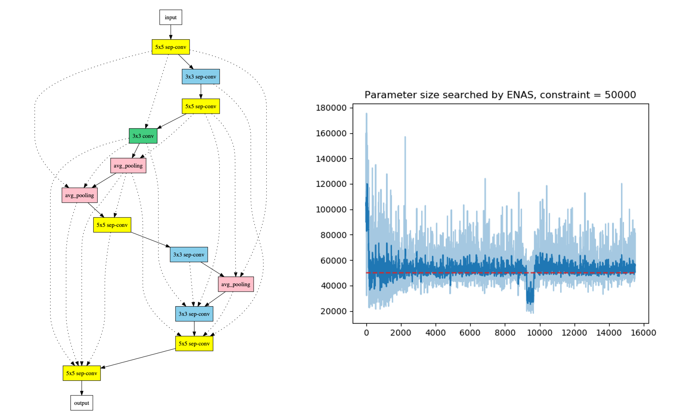

# Parameter Size Controllable Efficient Neural Architecture Search



The AutoML topic of Reinforcement Learning Course 2020 at UCAS is to evaluate the effectiveness of the ENAS method and design a parameter size controllable mechanism to search the neural structure. This project first re-implement the ENAS performance on the CIFAR-10 dataset under the macro search setting proposed by the original paper. Secondly, we devise a new reward function to enhance the ENAS method's ability to control the parameter size. Experiment results on the CIFAR-10 dataset verify the effectiveness of our method for controlling parameter size.

## Dependencies

- python=2.7
- tensorflow-gpu=1.13
- cuda=10.0


## CIFAR-10

To run the experiments on CIFAR-10, please first download the [dataset](https://www.cs.toronto.edu/~kriz/cifar.html). We provide a scirpt to directly download the dataset into the target folder.

```
./scripts/cifar10_download.sh
```

To run the ENAS experiments on the _macro search space_ as described in the original paper, please use the following scripts:
```
./scripts/cifar10_macro_search.sh
./scripts/cifar10_macro_final.sh
```

A macro architecture for a neural network with `N` layers consists of `N` parts, indexed by `1, 2, 3, ..., N`. Part `i` consists of:

* A number in `[0, 1, 2, 3, 4, 5]` that specifies the operation at layer `i`-th, corresponding to `conv_3x3`, `separable_conv_3x3`, `conv_5x5`, `separable_conv_5x5`, `average_pooling`, `max_pooling`.
* A sequence of `i - 1` numbers, each is either `0` or `1`, indicating whether a skip connection should be formed from a the corresponding past layer to the current layer.

A concrete example can be found in our script `./scripts/cifar10_macro_final.sh`.

To run the ENAS experiments on the parameter size-controlled search, please use the following script. You can modify the _controller_parameters_target_ and _controller_parameters_target_weight_ in the script to control the parameter size you want.

```
scripts\cifar10_macro_search_param_ctrl.sh
```

To calculate the parameter size of the neural structure designed by the ENAS, you can use the following script.

```
src\cal_para_num.py
```

## Acknowledgement

This project is based on the author's implementation of [Efficient Neural Architecture Search via Parameter Sharing](https://github.com/melodyguan/enas) (2018) in TensorFlow.
